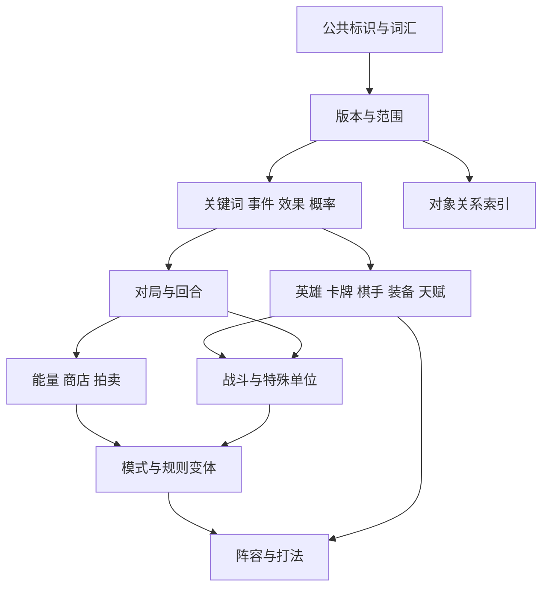
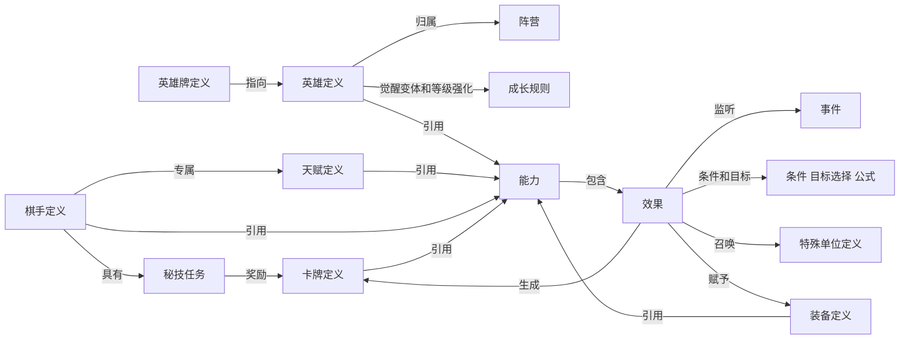

# 模块与关系定义

内容模型版本：0.4.0。模块定义描述知识的分类、对象与边界。

这里的模块是仓库中的内容责任边界，不是已实现的软件包、数据库表或服务。沿用现有 `rules/`、`entities/`、`relations/` 等目录，不引入网站模块。内部英文标识是本项目命名，不冒充官方接口或游戏资源 ID。

## 模块目录

| 标识 | 模块 | 主要内容 | 主要目录 |
| --- | --- | --- | --- |
| `match` | 对局与回合 | 参与者、阶段、区域、容量、生命与胜负结算 | `rules/match/` |
| `economy` | 能量、商店与拍卖 | 收支、刷新、卡池、竞拍和分红 | `rules/economy/` |
| `chessplayers` | 棋手与秘技 | 技能、任务、奖励牌、专属天赋 | `entities/chessplayers/` |
| `heroes` | 英雄、成长与觉醒 | 属性、品阶、阵营、成长、觉醒和技能强化 | `entities/heroes/` |
| `cards` | 卡牌与衍生内容 | 使用载体、变体、复制、生成与生命周期 | `entities/cards/` |
| `equipment` | 装备与铸造 | 成品、候选池、限制、穿戴、转移与移除 | `entities/equipment/` |
| `talents` | 天赋与选择池 | 品阶、候选、选择/刷新、专属/特邀条件 | `entities/talents/` |
| `mechanics` | 关键词、事件与效果 | 条件、目标、公式、技能、状态、触发链 | `rules/mechanics/`、`entities/abilities/`、`entities/keywords/`、`entities/statuses/` |
| `combat` | 战斗与特殊单位 | 站位、伤害、法力、技能、召唤、阵亡和复生 | `rules/combat/`、`entities/units/` |
| `modes` | 游戏模式、队列与规则变体 | 排位赛、钻石狂潮等目录、参与、资源、专属内容和结算 | `rules/modes/` |
| `strategy` | 阵容搭配、打法与版本环境 | 流派、常见阵容、组件、运营、站位、替代、克制及评价 | `strategies/` |
| `vocabulary` | 公共标识与词汇 | 稳定标识、阵营/定位、属性单位、资源和区域类型 | `schemas/`、`entities/taxonomies/` |
| `relations` | 对象关系索引 | 带范围和条件的显式关系 | `relations/` |
| `versions` | 版本与适用范围 | 内容修订、版本变化、地区/服务器/环境等范围 | `versions/` |

模式与阵容层的详细边界见[游戏模式与阵容](游戏模式与阵容.md)。

完整职责、对象清单、边界和依赖见 [modules.json](architecture/modules.json)，关系类型与转换见 [relations.json](architecture/relations.json)。内容目录不表示完整规则全集。

## 必须分开的对象

| 概念 | 保存什么 | 不应混同 |
| --- | --- | --- |
| 英雄定义 | 身份、品阶、阵营、属性、效果与技能引用 | 手里的一张牌、某局具体单位 |
| 卡牌定义/实例 | 载体指向、使用方式；具体牌的所有者、变体与有效期 | 使用后持续存在的天赋或装备 |
| 局内英雄成长状态 | 永久/临时等级、觉醒进度/状态与技能强化 | 棋手等级、固定品阶 |
| 参战单位 | 当前生命/法力、位置、目标、状态与来源 | 仅仅英雄；还可能是图腾、召唤物、棋手衍生单位 |
| 棋手定义/参与者状态 | 技能与任务定义；局内生命、等级、资源、牌和选择 | 用户账号、局外好感度 |
| 能力/效果/关键词/状态 | 能力组合、动作语义、触发约定、局内持续变化 | 一张混合“buff”标签表 |
| 版本记录/内容身份 | 稳定实体身份及某范围下的修订 | 文件更新时间、统一“最新版” |

英雄是一类单位定义，但并非所有单位都是英雄。天赋可生成天赋牌，装备可由装备载体产生，棋手任务可生成秘技牌；这些关系不能按同名记录自动合并。

## 模块依赖

下图是简化依赖图，箭头表示“后者使用前者的契约”，不是触发顺序。完整清单以 modules.json 的 `depends_on` 为准，字段方向为“本模块依赖列出的模块”。

适用范围是每条内容、公式和关系的共用要求，图中没有画出所有重复箭头。模式层引用明确基线与覆盖项，不复制一整套同名实体。对象之间可能存在循环引用或触发链，这不表示模块依赖也应形成循环。

## 游戏对象关系

对象关系分为身份关联、机制语义与可用性、实例归属、适用范围、策略建议五类。关系目录中的61种类型是表达能力定义，不是61条具体游戏规则；允许多对多也不是宣称游戏无数量上限。

实例关系必须归属于明确快照或等价不可变状态上下文；坐标通过 `relation_attributes.position` 或 `position_ref` 表达，装备槽位可用 `slot_ref`。状态有效区间未知时不能假定持续，同一实例在不同快照的关系不构成冲突。

本图刻意只表达定义关系。某局中谁持有哪张牌、谁穿戴装备、战斗单位的复制来源和所在格子，是带时间和实例标识的关系，不能写回英雄静态定义。

## 效果表达与状态变化

每个效果至少保留：来源能力、事件、条件、目标选择、动作、参数/公式、持续范围、重复/上限、叠加或唯一规则。缺失项写为未知，不补造默认值；复杂能力允许拆成有先后声明的多个效果，未知顺序不能自动排序。

10类关键状态转换已在关系目录中定义：打出英雄牌、觉醒、棋手升级、秘技完成、选择天赋、铸造装备、拍卖结算、开战、单位阵亡、回合结算。它们是需要分别维护前置条件和结果的过程，不是静态图上的普通边。

例如“打出牌 → 合成 → 触发监听 → 生成新牌”是事件链；“棋手 → 秘技任务 → 奖励牌”是内容关联。生成的牌是否自动使用、是否占池、是否继承状态，需要对应范围下的额外规则。

## 知识字段

知识记录采用下列共同字段：

| 字段组 | 定义 |
| --- | --- |
| 身份 | `entity_id` 稳定且带类型命名空间；名称是显示文本，不能用于唯一关联 |
| 修订 | `revision_id` 指向该实体在明确适用范围下的内容版本；不同版本的身份映射另存 |
| 范围 | 游戏规则版本、客户端版本线索、地区/服务器、测试/正式环境、模式和必要的段位/队伍条件；未知显式记录 |
| 内容 | 属性、公式/单位；不跨版本补齐成“现行”记录 |
| 主张类别 | `claim_kind` 区分规则事实、联动主张、策略建议与统计评价 |

规则版本和客户端版本可以不同，规则生效时间属于适用范围。模式覆盖需定位准确修订，优先级未定义或多个覆盖冲突时保留冲突，不默默采用最后一个文件。

## 模型目录

14个模块包括11个游戏领域模块及公共词汇、版本、关系3个支撑模块。关系目录包含61种类型和10类状态转换。

概率分布注明结果空间、概率或权重、单位及适用条件。抽样规则注明候选池、数量、有无放回、去重和分层过程；商店品阶层概率与指定英雄概率分开。公共池余量通过`PoolState`表达局内状态，未知余量不补造默认值。

研究、来源、验证报告和生产工具不属于此知识模型。
