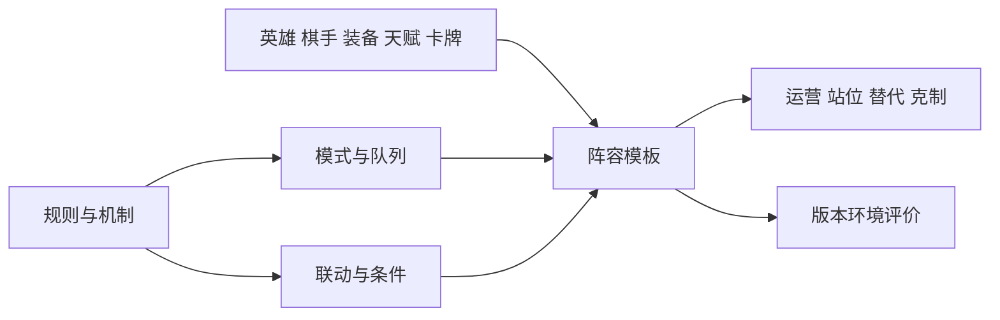

# 游戏模式与阵容

内容模型版本：0.5.0。

## 模式

模式由玩法、队列、竞赛/房间形式和局内变体组成。排位赛在本模型中表达为万象大赛的队列，钻石狂潮表达为玩法条目。分类是本项目知识模型，不是官方接口命名。

[模式目录](../rules/modes/catalog.json)包含万象大赛、排位赛和钻石狂潮，当前可用状态均为未知；该目录不是全部开放入口的清单。

| 对象 | 内容 |
| --- | --- |
| `ModeDefinition` | 玩法基线、局内结构与差异 |
| `QueueDefinition` | 使用的玩法、匹配、排位/组队和赛季规则 |
| `CompetitionFormatDefinition` | 竞赛或房间形式 |
| `AvailabilityRule` | 解锁、开放时间、参与限制 |
| `RuleOverride` / `SettlementVariant` | 特定范围的规则覆盖与结算差异 |
| `GlobalEventPool` | 模式事件池 |
| `PresetLineupDefinition` | 模式规定的初始阵容 |

模式记录包含参与条件、资源、内容池和结算等字段。字段存在不代表每个模式具有全部机制。规则覆盖引用具体基线与修订，不复制一套同名实体。

## 阵容与打法

[strategy模块](../strategies/README.md)表达规则之上的搭配方案。

| 对象 | 内容 |
| --- | --- |
| `LineupArchetype` | 联动思路、流派及别名 |
| `LineupTemplate` | 某版本、模式与条件下的具体方案 |
| `LineupSlot` | 核心位、功能位、替换位、数量与候选对象 |
| `SynergyClaim` | 效果之间的联动及成立条件 |
| `StrategyGuide` | 起手、升级/搜牌、拍卖、过渡、成型、转型和操作顺序 |
| `PositionPlan` / `SubstitutionPlan` | 阶段站位、对手条件、替代成本与关键组件 |
| `MatchupClaim` | 有条件的克制关系 |
| `RecommendationClaim` | 针对人群或场景的建议、条件与时效 |
| `MetaSnapshot` | 指定版本环境中的常见度、强度或难度评价 |

阵容除英雄外还引用棋手、装备、天赋和关键效果牌，区分必需、优先及可替换。同名流派可以有多套具体模板。

站位注明阶段与坐标系，装备建议通过`lineup_slot_ref`关联具体位置。组件、天赋、运营等缺失项分别标明，成型棋盘不默认等于完整打法。

## 关系

模式规定的初始阵容属于modes，推荐搭配属于strategy。关系类型见[关系目录](architecture/relations.json)。

`claim_kind`区分规则、联动、建议和统计评价。常见度注明人群、段位、模式、时间窗、样本量及分母；强度不能由热门度推导。克制关系包含等级、装备、站位等适用条件，不表示必胜。

实际知识条目见[游戏模式](游戏模式.md)和[阵容与打法](阵容与打法.md)。
