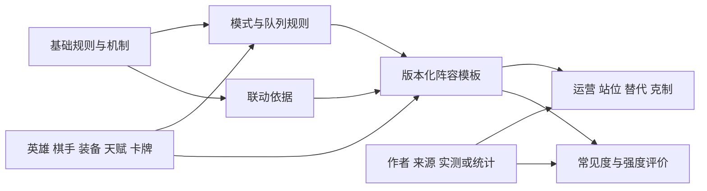

# 游戏模式与阵容

定义版本：0.2.0。核心内容包括基础规则、具体游戏模式，以及由这些规则构成的阵容与打法知识。

## 游戏模式模块

上一版 `modes` 只有规则覆盖框架，本版加入具体目录和需要维护的字段。[初始目录](../rules/modes/catalog.json)目前列出万象大赛、排位赛和钻石狂潮；并非当前全部开放入口的清单。

本项目将玩法、队列、竞赛/房间形式和局内变体分维度表达。例如排位赛建模为万象大赛的排位队列，钻石狂潮作为玩法条目。该分类是项目设计，不是声称官方菜单使用相同分类。

| 内容 | 排位赛需要记录 | 钻石狂潮需要记录 |
| --- | --- | --- |
| 参与与开放 | 解锁、段位限制、组队条件、开放状态 | 解锁、开放时间、场次分档和参与要求 |
| 对局结构 | 使用的基础玩法、匹配、赛季和队列差异 | 起手方式、初始阵容、回合与独立事件 |
| 资源与内容池 | 基础规则及排位适用的内容限制 | 模式货币、拍卖、专属英雄/牌/天赋/装备池 |
| 结算 | 名次、积分、段位变化、组队共享条件 | 胜负与收益、退出、奖励及排行榜规则 |
| 版本差异 | 段位门槛、队列和结算规则的变化 | 初始阵容、事件和模式专属内容的变化 |

这些是采集字段，并非已确认每个模式都拥有每项机制。模式资源与基础能量的关系需单独核对，不做简单名称替换。

[5月26日公告](https://www.taptap.cn/moment/807943215318565363)同时提到万象大赛排位赛与钻石狂潮，并描述钻石狂潮的起手、事件和结算变化；该公告明确属于终测整备验证阶段。[8月20日公告](https://www.taptap.cn/moment/839252912495396596)也有钻石狂潮专属内容调整，但适用体验服。这些支持模式需要独立记录，不能用来补成当前正式服规则。[9月24日公告](https://www.taptap.cn/moment/851825583556921530)有排位相关结算机制及钻石狂潮条目，仍不等于完整模式说明。

后续再核对王牌对决、残局挑战和其他入口的归属。段位、单排/组排、特邀等维度不自动各自建立一套重复模式。

## 阵容与策略模块

新增独立的 `strategy` 模块，目录为 [strategies/](../strategies/README.md)。它引用规则和实体的具体版本，维护下列内容：

| 对象 | 定义 |
| --- | --- |
| 阵容流派 `LineupArchetype` | 联动思路及别名，可对应多套具体阵容 |
| 阵容模板 `LineupTemplate` | 某版本、模式和条件下可使用的搭配方案 |
| 阵容位 `LineupSlot` | 核心位、功能位、可替换位、数量与候选英雄/卡牌引用 |
| 联动主张 `SynergyClaim` | 哪些效果如何配合，分别标明文字依据、推断或实测 |
| 打法说明 `StrategyGuide` | 起手、升级/搜牌、拍卖、过渡、成型、转型与操作顺序 |
| 站位与替代 `PositionPlan` / `SubstitutionPlan` | 阵型、对手条件、替代成本与无法替代的关键组件 |
| 克制主张 `MatchupClaim` | 对应对手、等级/装备等条件、理由及验证范围 |
| 推荐主张 `RecommendationClaim` | 谁推荐、针对什么人群/场景、适用版本与失效条件 |
| 版本环境 `MetaSnapshot` | 常见度、强度或难度的评价与来源、时间窗及统计口径 |

阵容模板除了英雄列表，还需要引用推荐棋手、装备、天赋和关键效果牌；区分必需、优先与可替换，解释联动和资源要求。不同作者的同名阵容可以是不同模板，不能按名字合并。

官方[新手指引](https://wxq.qq.com/cp/a202609xszy/index.html)中的三分登场、日落海整备、大河图腾、河洛古币、逐鹿战术，可作为第一批流派整理线索。这些是教学主题，不据此宣布它们是当前最常见或最强的阵容。本次尚未收录其完整组件和运营方案。

官网[阵容页面](https://wxq.qq.com/cp/a20260707sfgw/m_teamlist.html)的源码也提供搭配和运营分区线索，但包含其他游戏的模板占位文案；本次未核对其渲染列表，不收录这些占位阵容。

## 关系与证据边界

模式规定的初始阵容由 `modes` 的 `PresetLineupDefinition` 维护；玩家推荐的搭配方案由 `strategy` 的 `LineupTemplate` 维护。策略需要注明所依据的模式规则，不能因为都叫“阵容”而混在一起。

新增关系表达队列归属、模式事件/初始阵容、阵容组成、推荐搭配、联动、替代、克制及评价范围，见[关系目录](architecture/relations.json)。这些关系类型不代表具体推荐已经有效。

规则事实、联动主张、策略建议、统计评价通过 `claim_kind` 区分。尤其：

- “能否触发”与“是否值得这样搭配”是不同问题；实测某个机制不等于验证整套阵容强度。
- “常见”需说明人群/段位/模式、时间窗、样本来源与数量、出现率口径。只有作者经验时标为经验评价，未知分母不得计算使用率。
- “强势”“新手友好”等建议保留作者、评价理由、适用条件与时效；统计胜率需有独立样本口径，不能用热门度推导强度。
- 克制关系是有条件的建议或观察，不承诺确定胜负。旧版本效果变化后，对应联动和推荐标记为待复核。

本版完成模块和字段定义及初始模式发现目录；当前完整模式规则、完整阵容目录、热门榜与对局统计尚未建设。
