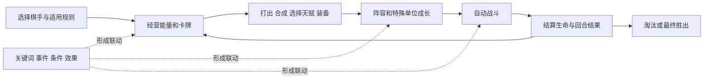

# 游戏理解与依据

研究日期：2026-10-01。目标是理解足以划分模块的游戏结构，尚未完成全部游戏机制和当前版本数值的核验。

## 实际研究了什么

- 直接读取腾讯[官方新手指引](https://wxq.qq.com/cp/a202609xszy/index.html)的正文及两张英雄配图，覆盖基础规则、棋手、英雄、天赋、能量、竞拍与代表性棋手机制。网页读取工具超时，改用普通 HTTP 获取成功；未执行网页脚本。
- 阅读官方账号的[9月24日 v1.3.1 更新公告](https://www.taptap.cn/moment/851825583556921530)，核对能力类别、永久/临时成长、版本变更和规则例外。
- 阅读官方[整备介绍](https://www.taptap.cn/moment/840571229957001144)、[开团介绍](https://www.taptap.cn/moment/840550555410498024)与[登场介绍](https://www.taptap.cn/moment/840363330051770359)，确认事件驱动的联动结构。
- 检查既有两套社区候选资料及历史游戏截图。这些是结构线索，未作为当前正式服的完整数据库。
- 尝试读取现有游戏窗口，应用定位出现重复标识，两个实际应用路径读取均超时。本次未成功进入图鉴或进行战斗实测；9月30日截图仍是历史证据。

来源登记见 [sources.json](research/sources.json)。网页原文、配图和历史截图仅保留本地，不公开提交。研究说明是概括与建模判断，未转载完整原文。

## 已有直接官方文字支持的结构

官方新手指引描述六人对局，以生命淘汰决定胜负；购买和打出英雄牌用于建立、强化场上阵容。棋手成长会影响天赋选择、上阵容量与获取高阶牌的机会。能量用于经营卡牌和棋手；竞拍是多人共享的获得途径，并有分红。棋手还有技能、秘技任务及专属天赋。以上说明适用范围以该指引为准，页面没有标明完整游戏版本，不能代替当前客户端核对。

因此，游戏结构可概括为：

这是概念流程，不规定竞拍具体回合、整备与其他回合事件的先后、技能优先级或结算公式。

## 会改变架构的几个事实与判断

1. **定义、卡牌、场上状态、战斗状态必须分开。** 官方指引区分购牌、打出生成英雄、同名合成和查看场上属性。模型由此分别表达稳定内容与具体实例；返回手牌、复制时保留什么仍需验证。
2. **棋手不是仅供展示的头像。** 官方指引列举棋手的输出、特殊单位和生成牌机制，因此棋手能力可以关联战斗单位、效果、任务、奖励牌和装备。本次不整理这些例子的完整数值。
3. **卡牌效果与战斗技能不同。** 更新公告将英雄卡牌效果和技能分别调整；觉醒前后效果与等级技能也分别表述。[依据](https://www.taptap.cn/moment/851825583556921530)
4. **成长存在不同维度。** 同一公告明确区分永久等级和临时等级，以及觉醒前后效果；社区候选另提供觉醒进度和等级强化线索。模型保留各维度，精确觉醒阈值、等级门槛和状态继承待核对。
5. **规则必须允许例外。** 公告新增能量透支及负能量时的出牌限制，说明资源下界不能永久硬编码为零。[依据](https://www.taptap.cn/moment/851825583556921530)
6. **关键词形成事件联动。** 官方将登场、整备、开团对应到不同触发窗口。需要事件、条件、目标和效果描述；它们不能只存成无语义标签。多个效果的优先级未实测。
7. **对象可因效果获得新行为。** 公告涉及英雄被赋予牺牲、装备与单位互动和特殊情境修复，因此“初始标签”不足以穷尽局内行为。[依据](https://www.taptap.cn/moment/851825583556921530)
8. **版本变化不都改变行为。** 庄小鱼条目属于描述澄清，不能把每次文本差异都标为机制改动。[依据](https://www.taptap.cn/moment/851825583556921530)

以上架构判断服务于内容表达；不声称已实现官方战斗算法。

## 候选资料中的冲突与缺口

本地社区快照的摘要统计为：一套包含85条英雄、18条棋手、78条装备、254条天赋、99条效果牌；另一套包含96行英雄（其中一行无名）、25条棋手，并混有终极测试与秋季测试标记。这些只是文件记录数，不是当前游戏总量，也不作为覆盖率分母。

- 攻略出现8人、固定金币利息、三星、人数羁绊等写法，与官方指引或同仓库其他文档不符，不用于确定本项目基础规则。
- 有资料把10/40/100级强化称作觉醒，另有资料单列合成觉醒进度；本项目把这些作为不同概念，门槛不写死。
- 来源中的 `cost`、`energy`、`quality`、`stage` 等字段存在语义不明或不同类别语义不一致，不能仅按英文名映射购买成本、法力或品质。
- 名称相同不表示实体相同；天赋、装备、英雄、棋手可共享名称。关键词索引也可能混入定位、阵营和攻略标签。
- 官方指引的关键词细则部分保留在被注释的 HTML 中；注释不是当前可见规则，尤其不能据此认定转瞬清理时点、复生次数上限或夺取数值。
- 历史来源有复制、觉醒回手、公共卡池、装备铸造、图腾等线索，但缺少当前版本的完整字段与实测。不同来源不能无条件拼成一条“完整英雄”。

## 尚需补齐的知识

| 问题 | 为什么影响模型 | 下一步证据 |
| --- | --- | --- |
| 觉醒进度、回手/再上阵和状态继承 | 英雄牌与单位之间的转换 | 当前图鉴文字与受控操作 |
| 永久/临时等级及战斗快照回写 | 避免把战斗临时状态写入长期养成 | 战前、战中、战后对照 |
| 卡池占用、复制、召唤和随机选择 | 确定生成与概率约束 | 对应牌/技能文字与多次观察 |
| 铸造候选、装备限制、转移与特殊单位 | 装备不是简单物品列表 | 当前装备规则与操作验证 |
| 多事件、阵亡、牺牲、复生和召唤顺序 | 决定真实联动能否成立 | 单变量实验与重复观察 |
| 伤害、防御、法力、目标、取整和上限 | 战斗公式与效果公式 | 规则说明与数值实验 |
| 模式、段位与组队对内容/结算的影响 | 决定适用范围和覆盖层 | 当前模式入口与说明 |
| 所有对象及隐藏衍生内容的总量 | 决定完整性分母 | 按版本建立目录并交叉核对 |

本次已理解用于模块划分的核心结构；以上未知项足以限制具体数值、机制算法和完整性声明。模块定义保留这些未知项，不以它们阻止先定义职责和关系类型。
